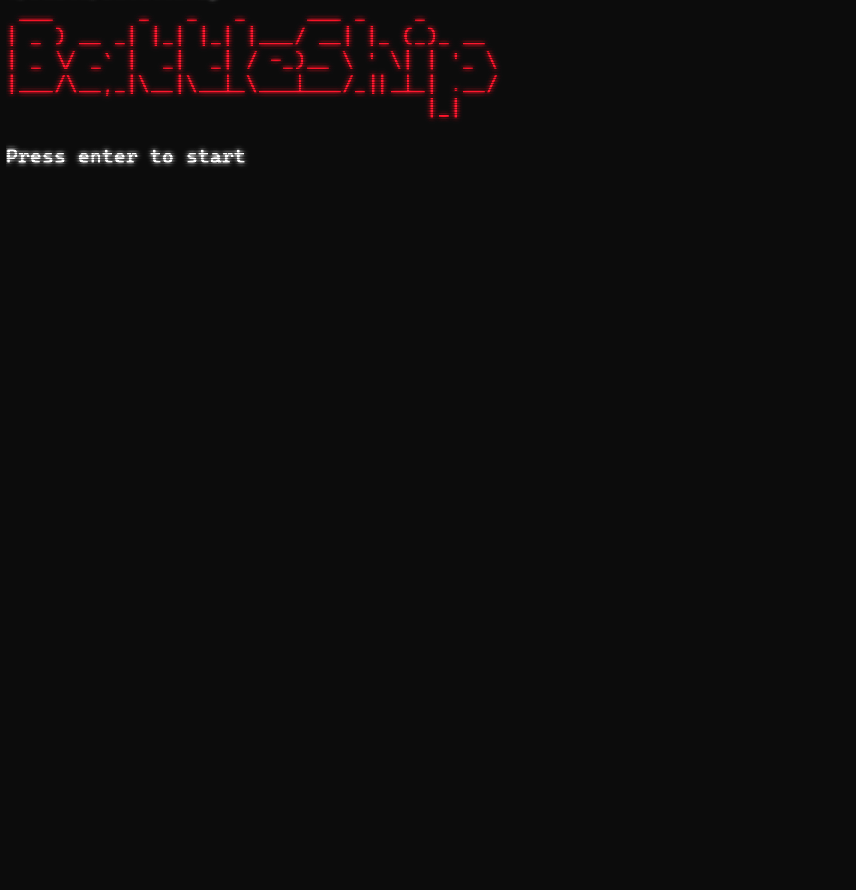
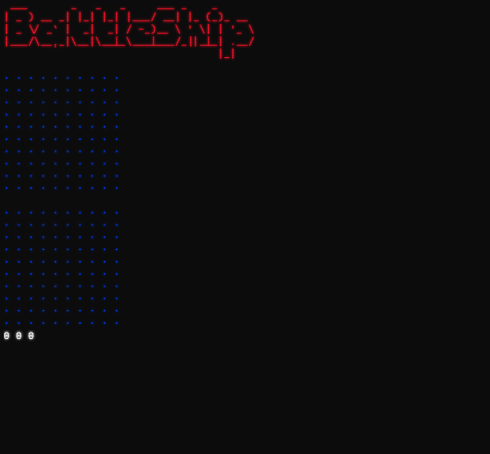
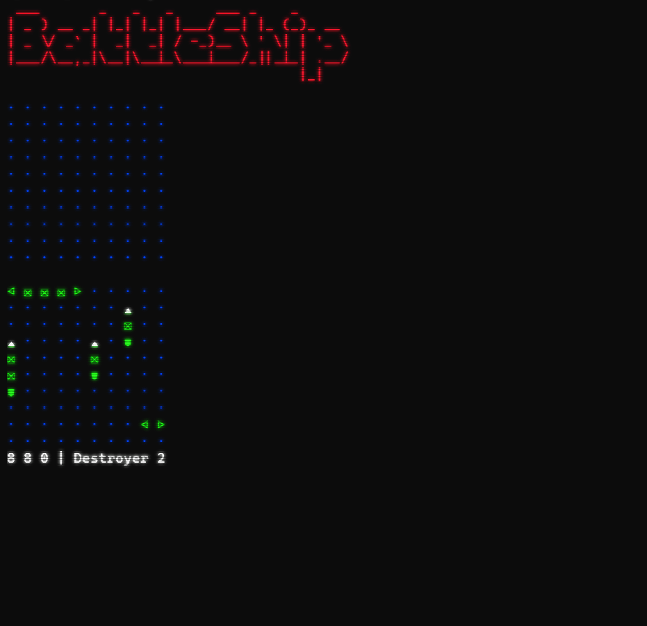

# **BattleShip v.2**

*v.1 was created using struct and windows.h for colorfull efects*

*v.2 is a v.1 remake using OOP, cmake and using [ANSI](https://gist.github.com/fnky/458719343aabd01cfb17a3a4f7296797) Standard escape codes*

## Start screen

## Gameplay features

* Place your ships with arrow keys
* Rotate your ships for better position using `R` key
* Use `ESC` key if you want to place ships random

## Placing shots

* Place your shots with arrow keys

